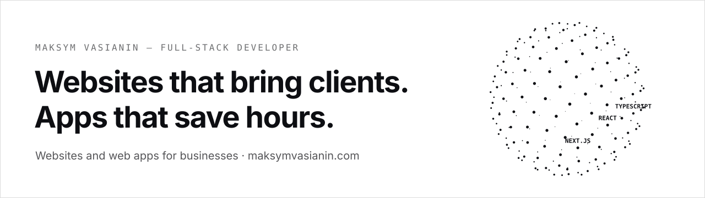

<picture><source media="(prefers-color-scheme: dark)" srcset="./assets/banner-dark.svg"></picture>

  <a href="https://maksymvasianin.com"><picture><source media="(prefers-color-scheme: dark)" srcset="https://img.shields.io/badge/maksymvasianin.com-e6e6e6?style=for-the-badge&logo=googlechrome&logoColor=0d0e12"></picture></a>
  <a href="https://t.me/wmm_02"><picture><source media="(prefers-color-scheme: dark)" srcset="https://img.shields.io/badge/Telegram-e6e6e6?style=for-the-badge&logo=telegram&logoColor=0d0e12"></picture></a>
  <a href="https://www.linkedin.com/in/m-vasianin/"><picture><source media="(prefers-color-scheme: dark)" srcset="https://img.shields.io/badge/LinkedIn-e6e6e6?style=for-the-badge&logo=linkedin&logoColor=0d0e12"></picture></a>
  <a href="mailto:vasanin02@gmail.com"><picture><source media="(prefers-color-scheme: dark)" srcset="https://img.shields.io/badge/Email-e6e6e6?style=for-the-badge&logo=gmail&logoColor=0d0e12"></picture></a>
  <a href="https://www.patreon.com/cw/VasianinMaksim"><picture><source media="(prefers-color-scheme: dark)" srcset="https://img.shields.io/badge/Support_on_Patreon-e6e6e6?style=for-the-badge&logo=patreon&logoColor=0d0e12"></picture></a>

Independent full-stack developer from Ukraine. I build websites and web applications for businesses — from the first conversation to a launched product, and support after launch. You work with me directly.

## What I do

| | |
| --- | --- |
| **Websites** — modern sites on Next.js, React and TypeScript, from a finished design or an agreed structure, with SEO and accessibility in place. | **Business web applications** — user accounts, booking systems, internal tools, integrations and process automation. |
| **Fast launches on Framer** — landing pages and small sites on a tight timeline, without losing quality. | **Support and development** — bug fixes, new features, updates and performance work on existing projects. |

## How I work

| 01 · Discovery | 02 · Planning | 03 · Development | 04 · Launch |
| --- | --- | --- | --- |
| I get to know the project, define the goals and the result you expect. | I estimate the scope and timeline, and choose the right approach to build it. | I build the functionality, implement the design and integrate the services you need. | Testing, publishing the project and support after release. |

## Stack

TypeScript · React · Next.js · Node.js · NestJS · Tailwind CSS · Framer · Figma · Firebase · Vercel

## Open source

| Project | What it does | |
| --- | --- | --- |
| [**framer-sitewright**](https://github.com/maximwas/framer-sitewright) | MCP server and CLI that let AI agents build and edit Framer sites, with a local journal you can undo. | [Docs](https://maximwas.github.io/framer-sitewright/) |
| [**px-to-tailwind-plus**](https://github.com/maximwas/px-to-tailwind-plus) | VS Code and Cursor extension: type `p-16px`, get `p-4`; Tailwind v3 and v4. |  |

## Activity

  <picture><source media="(prefers-color-scheme: dark)" srcset="https://streak-stats.demolab.com?user=maximwas&hide_border=true&date_format=j%20M%5B%20Y%5D&background=0D0E12&stroke=2A2B30&ring=E6E6E6&fire=E6E6E6&currStreakNum=E6E6E6&sideNums=E6E6E6&currStreakLabel=E6E6E6&sideLabels=E6E6E6&dates=9A9A9A"></picture>
  <picture><source media="(prefers-color-scheme: dark)" srcset="https://github-readme-stats.vercel.app/api/top-langs/?username=maximwas&layout=compact&hide_border=true&langs_count=6&bg_color=0d0e12&title_color=e6e6e6&text_color=e6e6e6"></picture>

---

  Open for new projects → <a href="https://maksymvasianin.com"><b>maksymvasianin.com</b></a> 
  Українською: незалежний Full-Stack розробник — сайти та вебзастосунки для бізнесу · <a href="https://maksymvasianin.com/ua">maksymvasianin.com/ua</a>

